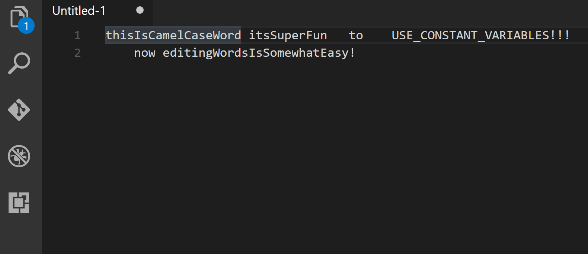

blah

# Select Part Of Word

   

An extension that allows you to move selection by a word in camel-case string. This comes especially handy if you want to fix a typo in the middle of the variable, or just reword a part of it.

## Features

* Support for unicode characters.
* Support for multiple selections.

### Default Hotkeys

Hotkey | Description
---|---
`CTRL+ALT+RIGHT` | Move caret to the next word
`CTRL+ALT+LEFT` | Move caret to the previous word
`CTRL+SHIFT+ALT+RIGHT` | Expands selection to the next word
`CTRL+SHIFT+ALT+LEFT` | Expands selection to the previous word
`CTRL+ALT+BACKSPACE` | Removes previous word
`CTRL+ALT+DELETE` (`CTRL+SHIFT+ALT+DELETE` on Windows) | Removes next word

## Looking For Feedback

Please note that this extension is in rather early stage of development.

### Source Code

This extension is fully open source, available at [https://github.com/mlewand/vscode-select-part-of-word](https://github.com/mlewand/vscode-select-part-of-word).

### Getting In Touch

You can always ping me at Twitter [@m_lewand](https://twitter.com/m_lewand).

## License

The code is distributed under MIT license.

* Image at `assets/icon.svg` distributed under Creative Commons license, obtained from [Wikimedia Commons](https://commons.wikimedia.org/wiki/File:PEO-bactrian_camel.svg).
